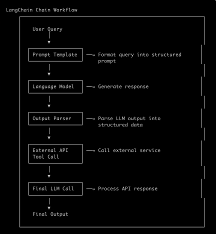

Ideas used in above chain:

## Composition Idea: External API Tool Call response is embedded and fed to the Final LLM call
## LCEL idea: Chaining using LangChain Expression Language. Creates Runnable Chain object.
[https://blog.langchain.com/langchain-expression-language/]
## Runnanble Idea: [https://reference.langchain.com/python/langchain_core/runnables/]
## Chat Models Idea: [https://docs.langchain.com/oss/python/langchain/models]

## LangChain Core suit: [https://reference.langchain.com/python/langchain_core/]
### Concept Explanation

This pattern demonstrates a **tool-augmented LLM workflow** where:

1. **Tool Definition**: Define external tools (APIs, functions) that the LLM can invoke
2. **Tool Execution**: The LLM decides to call a tool and receives the response
3. **Response Embedding**: The tool's response is embedded back into the conversation context
4. **Final LLM Call**: A final LLM call processes the enriched context to generate the final answer

### Architecture Flow

```
User Query
    ↓
LLM (Decides to use tool)
    ↓
Tool Execution (API/Function Call)
    ↓
Tool Response
    ↓
Embed Response in Context
    ↓
Final LLM Call (With enriched context)
    ↓
Final Answer
```

### Benefits

- **Enhanced Reasoning**: LLM can access real-time data
- **Separation of Concerns**: Logic isolated in tools
- **Flexibility**: Multiple tools can be chained
- **Accuracy**: Real data replaces hallucinations
````

Now, here's a working Python example using LangChain:

````python
from langchain.agents import Tool, initialize_agent, AgentType
from langchain.llms import OpenAI
from langchain.prompts import PromptTemplate
from langchain_core.tools import tool
import requests
import json

# ============================================================================
# STEP 1: Define External Tools
# ============================================================================

@tool
def get_weather(city: str) -> str:
    """Fetch current weather for a given city from an external API"""
    try:
        # Simulating an external API call (replace with real API)
        weather_data = {
            "New York": "Sunny, 72°F",
            "London": "Rainy, 55°F",
            "Tokyo": "Cloudy, 68°F"
        }
        return json.dumps(weather_data.get(city, f"Weather data not found for {city}"))
    except Exception as e:
        return f"Error fetching weather: {str(e)}"

@tool
def get_stock_price(symbol: str) -> str:
    """Fetch current stock price for a given symbol"""
    try:
        # Simulating stock API call
        stock_data = {
            "AAPL": "$195.50",
            "GOOGL": "$140.25",
            "MSFT": "$380.75"
        }
        return json.dumps(stock_data.get(symbol, f"Stock data not found for {symbol}"))
    except Exception as e:
        return f"Error fetching stock price: {str(e)}"

# ============================================================================
# STEP 2: Create Tool Instances
# ============================================================================

tools = [
    get_weather,
    get_stock_price
]

# ============================================================================
# STEP 3: Initialize Agent with Tools
# ============================================================================

llm = OpenAI(temperature=0, model="gpt-3.5-turbo")

agent = initialize_agent(
    tools=tools,
    llm=llm,
    agent=AgentType.ZERO_SHOT_REACT_DESCRIPTION,
    verbose=True,
    handle_parsing_errors=True
)

# ============================================================================
# STEP 4: Define Composition Function
# ============================================================================

def tool_call_composition(user_query: str) -> dict:
    """
    Executes the tool-call composition pattern:
    1. LLM decides to call external tools
    2. Tool responses are embedded in context
    3. Final LLM call generates answer with enriched context
    """
    
    print(f"\n{'='*70}")
    print(f"USER QUERY: {user_query}")
    print(f"{'='*70}\n")
    
    # Step 1: Agent processes query and calls tools
    tool_response = agent.run(user_query)
    
    # Step 2: Embed tool response in enriched context
    enriched_context = f"""
    Original Query: {user_query}
    Tool Response Data: {tool_response}
    """
    
    # Step 3: Final LLM call with enriched context
    final_prompt = PromptTemplate(
        input_variables=["context"],
        template="""Based on the following information, provide a comprehensive and natural answer:

{context}

Please synthesize this information into a clear, concise response that directly answers the original query."""
    )
    
    final_answer = llm(final_prompt.format(context=enriched_context))
    
    return {
        "original_query": user_query,
        "tool_responses": tool_response,
        "final_answer": final_answer,
        "enriched_context": enriched_context
    }

# ============================================================================
# STEP 5: Execute Example Queries
# ============================================================================

if __name__ == "__main__":
    # Example 1: Weather query
    result1 = tool_call_composition(
        "What's the weather like in New York and London?"
    )
    print(f"\nFINAL ANSWER:\n{result1['final_answer']}\n")
    
    # Example 2: Stock price query
    result2 = tool_call_composition(
        "Compare the stock prices of AAPL and GOOGL. Which is more expensive?"
    )
    print(f"\nFINAL ANSWER:\n{result2['final_answer']}\n")
    
    # Example 3: Combined query
    result3 = tool_call_composition(
        "Tell me the weather in Tokyo and the current price of MSFT stock"
    )
    print(f"\nFINAL ANSWER:\n{result3['final_answer']}\n")
````

### Key Components Explained:

1. **@tool decorator** - Defines functions as LangChain tools
2. **initialize_agent** - Creates an agent that can decide when to use tools
3. **AgentType.ZERO_SHOT_REACT_DESCRIPTION** - Agent type that reasons about tool usage
4. **Embedding** - Tool responses are injected back into the context
5. **Final LLM Call** - Processes enriched context for polished output

This pattern is powerful for agentic AI applications!