* Agent is a software system that uses LLMs as reasoning engine to decide what actions to take, and then execute those actions.

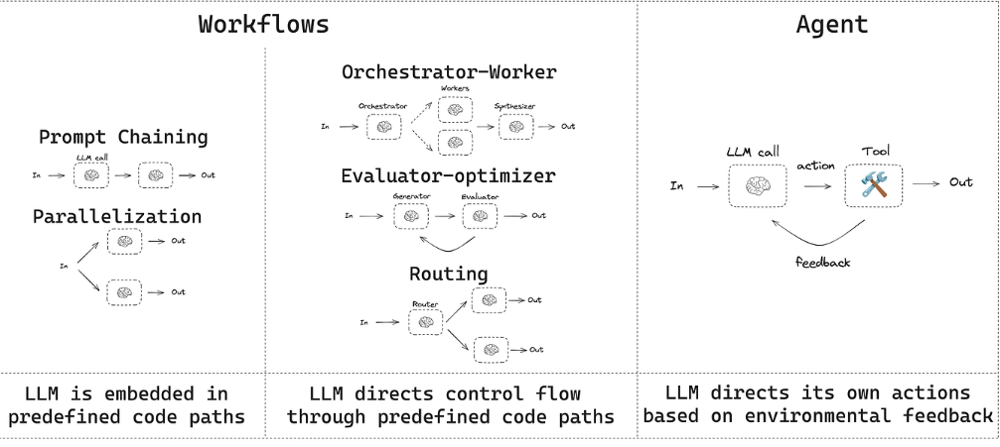
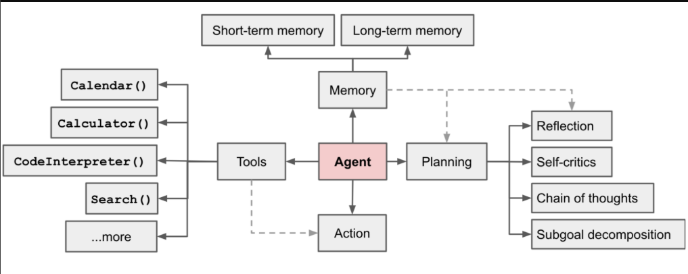

## ReAct Agent:: [https://www.dailydoseofds.com/ai-agents-crash-course-part-10-with-implementation/]

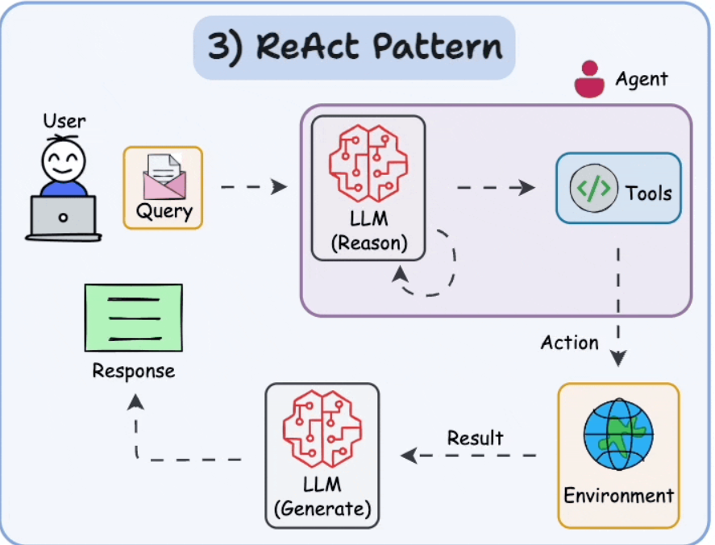

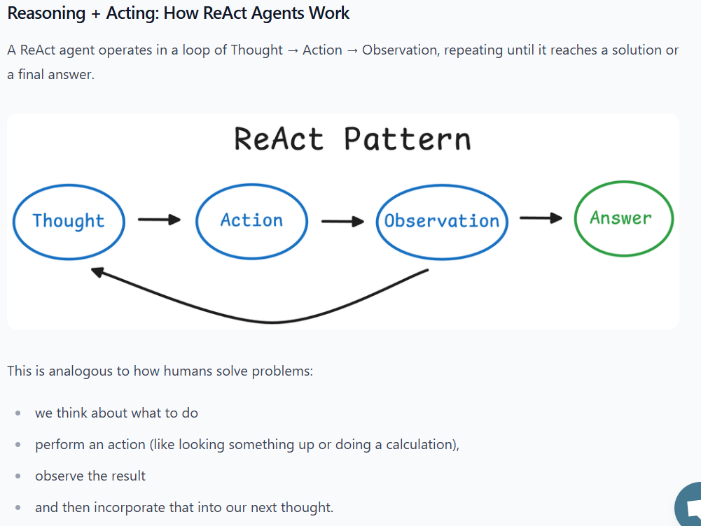

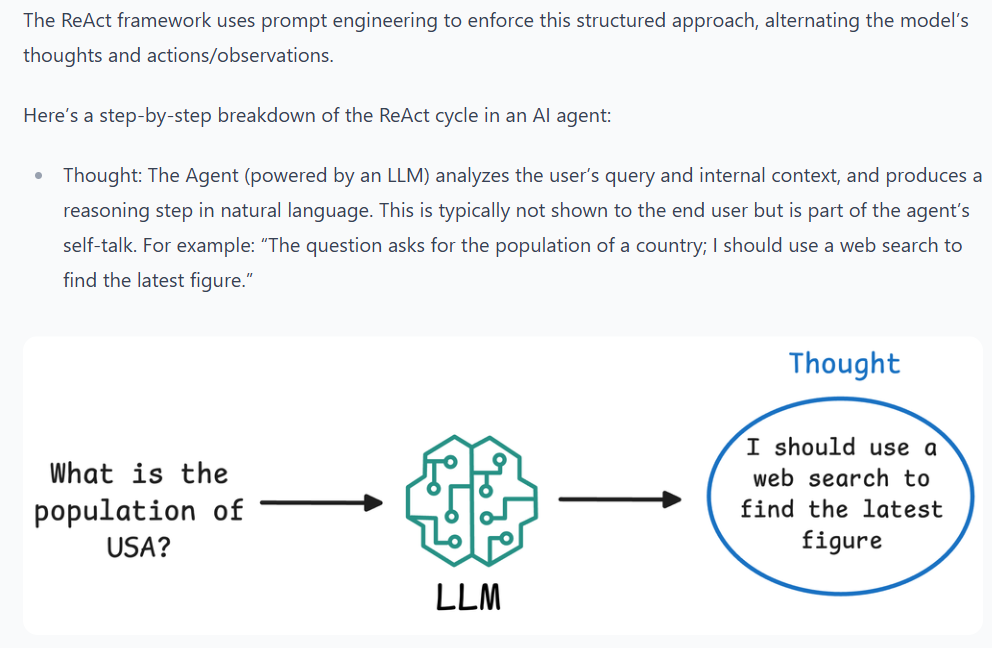

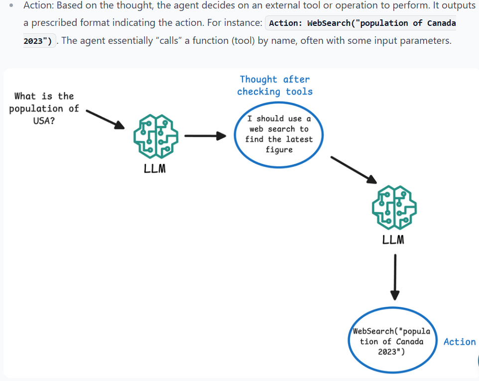

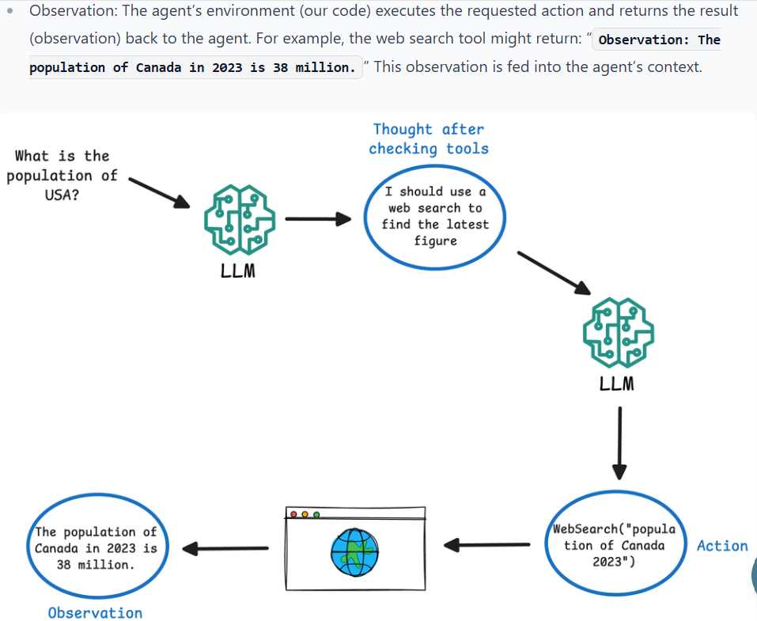

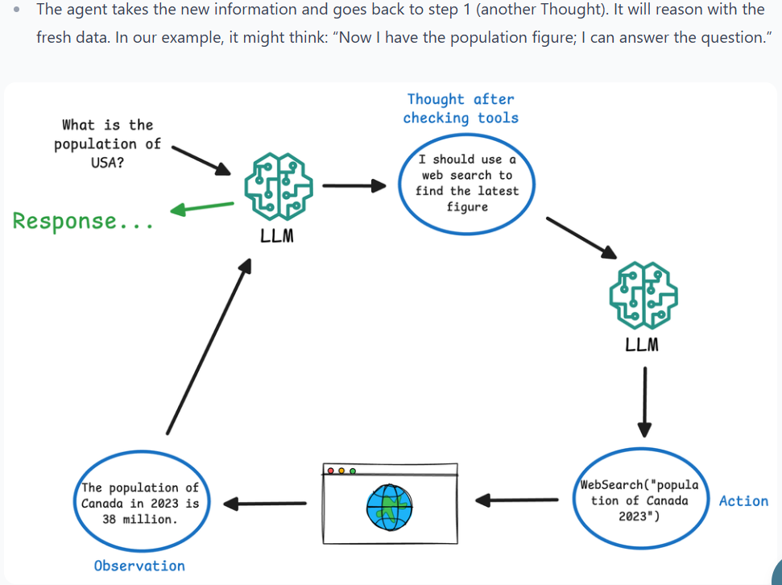

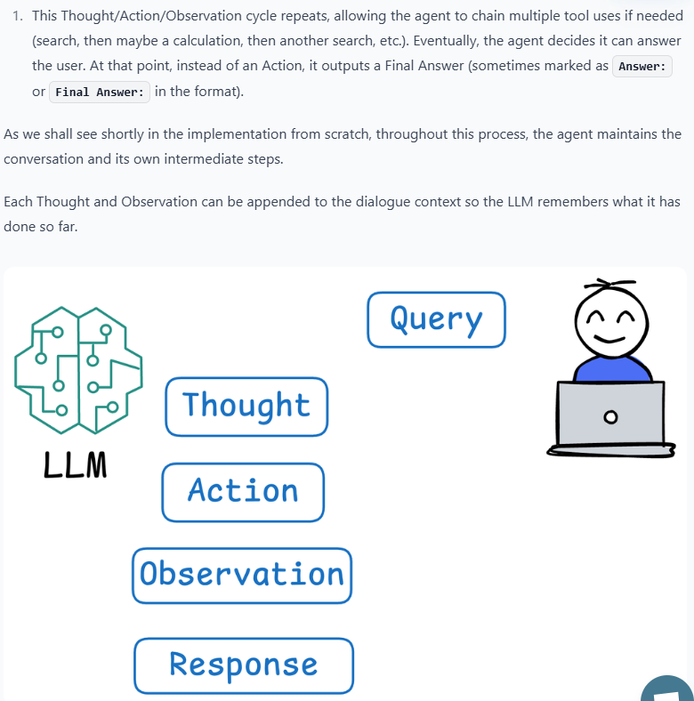

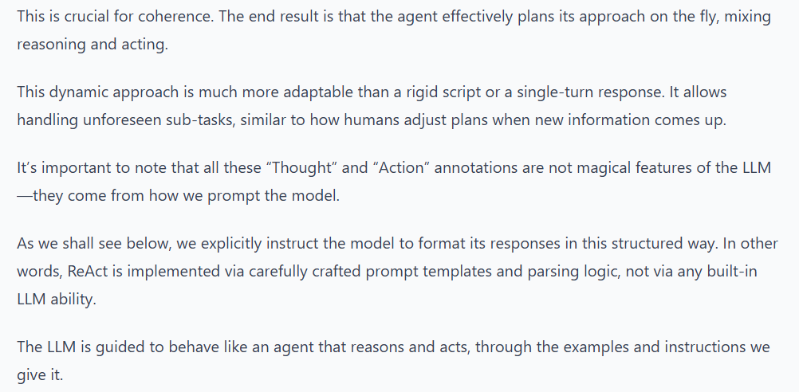
 
## 
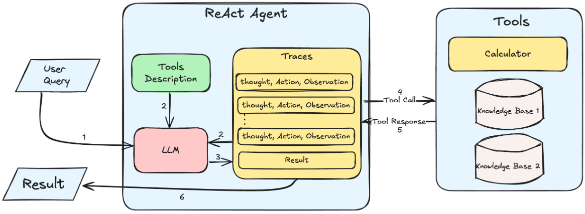